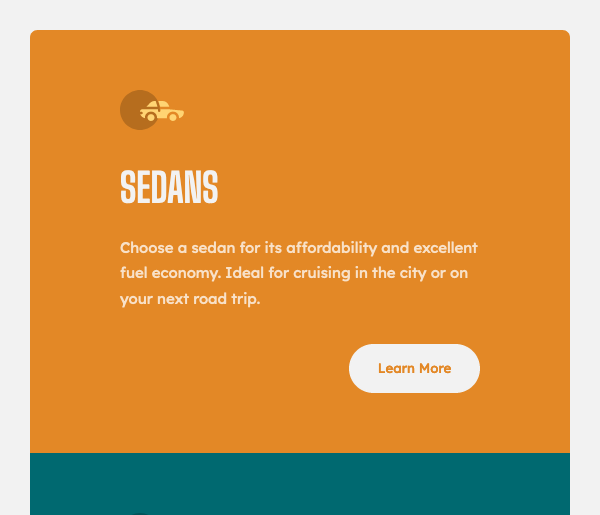

# Frontend Mentor - 3-column preview card component solution

This is a solution to the [3-column preview card component challenge on Frontend Mentor](https://www.frontendmentor.io/challenges/3column-preview-card-component-pH92eAR2-). Frontend Mentor challenges help you improve your coding skills by building realistic projects.

## Table of contents

- [Overview](#overview)
  - [The challenge](#the-challenge)
  - [Screenshot](#screenshot)
  - [Links](#links)
- [My process](#my-process)

  - [Built with](#built-with)
  - [What I learned](#what-i-learned)

- [Author](#author)

## Overview

### The challenge

Users should be able to:

- View the optimal layout depending on their device's screen size
- See hover states for interactive elements
- This has been achieved, the design is fully responsive.

---

### Screenshot at desktop size

---


---

|                   Mobile                   |                   Tablet                   |
| :----------------------------------------: | :----------------------------------------: |
|  |  |

### Links

- Solution URL: [Add solution URL here](https://your-solution-url.com)
- Live Site URL: [Here](https://3-column-preview-card-component-wom.netlify.app/)

## My process

Mobile first HTML and SCSS with Flexbox

### Built with

- Semantic HTML5 markup
- BEM class naming
- CSS custom properties
- SCSS
- Flexbox
- Mobile-first workflow

### What I learned

I wanted the design to work across all sizes and so created a layout that looked a bit better on a tablet.

To control the image size I used the min() function, which allowed it scale nicely.

```css
&__image {
  width: min(20vw, 4.27rem);
}
```

I coupled this with shifting the flex layout to align center, the button to align-self: flex-end and also adjusting the character width for the text.

```css
&__button {
  align-self: flex-end;
}
```

```css
&__text {
  max-width: 40ch;
}
```

## Author

- Website - [Mark Lawson](https://walkonmars.dev/)
- Frontend Mentor - [@walkonmars36](https://www.frontendmentor.io/profile/walkonmars36)
- Twitter - [@redmarkel](https://www.twitter.com/redmarkel)
